# Contract Comparison Platform

<div align="center">


**AI-Powered Autonomous Contract Comparison and Change Extraction**

[Python Backend](./python/README.md) · [Ruby Frontend](./ruby/README.md)

</div>

---

## The Problem

Legal compliance teams spend **40+ hours weekly** manually comparing contracts and their amendments. This process is:

- **Error-prone**: Human fatigue leads to missed changes
- **Time-consuming**: Each comparison can take 2-4 hours
- **Inconsistent**: Different analysts may interpret changes differently
- **Bottleneck**: Delays contract processing and approvals

## The Solution

This platform automates contract comparison using a **multi-agent AI system** that:

1. **Parses scanned documents** using multimodal LLMs (GPT-5.2)
2. **Analyzes document structure** and identifies corresponding sections
3. **Extracts specific changes** with detailed summaries
4. **Validates output** ensuring data quality for downstream systems
5. **Provides full observability** via Langfuse tracing

## System Architecture

```mermaid
flowchart TB
    subgraph User["👤 User Layer"]
        Browser["🌐 Web Browser"]
    end

    subgraph Rails["💎 Ruby on Rails Frontend"]
        subgraph Web["Web Interface"]
            Upload["📤 Upload Forms"]
            Display["📊 Result Display"]
            History["📋 History List"]
        end
        
        subgraph Storage["Active Storage"]
            S3["☁️ AWS S3"]
            URLs["🔗 Pre-signed URLs"]
        end
        
        subgraph Realtime["ActionCable"]
            WS["🔌 WebSocket"]
            Progress["📈 Real-time Progress"]
        end
        
        Queue["⚙️ Solid Queue<br/>ComparisonJob"]
    end

    subgraph Python["🐍 Python AI Backend"]
        subgraph Pipeline["Multi-Agent Processing Pipeline"]
            Parser["🔍 Image Parser<br/>(GPT-5.2)"]
            Agent1["🤖 Agent 1<br/>Contextualize"]
            Agent2["🤖 Agent 2<br/>Extract Changes"]
            Validator["✅ Pydantic<br/>Validation"]
        end
        
        Langfuse["📊 Langfuse Tracing<br/>Observability"]
    end

    Browser --> Upload
    Upload --> S3
    S3 --> Queue
    Queue -->|"HTTP REST API"| Parser
    Parser --> Agent1
    Agent1 --> Agent2
    Agent2 --> Validator
    Validator --> Queue
    Queue --> Progress
    Progress --> Browser
    Pipeline -.-> Langfuse

    style User fill:#e3f2fd
    style Rails fill:#ffebee
    style Python fill:#e8f5e9
    style Pipeline fill:#fff3e0
```



### Service Communication


## Component Overview

| Component | Technology | Purpose |
|-----------|------------|---------|
| **Frontend** | Ruby on Rails 8 | Web interface, file uploads, real-time updates |
| **Backend** | Python 3.10+ | AI agents, document parsing, change extraction |
| **AI Model** | OpenAI GPT-5.2 | Multimodal document understanding |
| **Storage** | AWS S3 | Cloud document storage |
| **Database** | PostgreSQL | Comparison results, metadata |
| **Job Queue** | Solid Queue | Async processing |
| **WebSocket** | ActionCable | Real-time progress updates |
| **Observability** | Langfuse | LLM tracing and monitoring |

## Project Structure

```
henry_task_04/
├── python/                          # AI Backend Service
│   ├── src/
│   │   ├── agents/                  # Multi-agent system
│   │   │   ├── contextualization_agent.py
│   │   │   └── extraction_agent.py
│   │   ├── main.py                  # CLI & API entry point
│   │   ├── models.py                # Pydantic schemas
│   │   ├── image_parser.py          # Multimodal OCR
│   │   └── tracing.py               # Langfuse integration
│   ├── tools/                       # Utilities
│   │   └── generate_contracts.py    # Test data generator
│   ├── tests/                       # Test suite
│   ├── pyproject.toml               # Python config
│   └── README.md                    # Python documentation
│
├── ruby/                            # Rails Frontend Service
│   ├── app/
│   │   ├── controllers/             # Web controllers
│   │   ├── models/                  # ActiveRecord models
│   │   ├── jobs/                    # Background jobs
│   │   ├── services/                # Python client
│   │   ├── channels/                # ActionCable channels
│   │   └── views/                   # ERB templates
│   ├── config/                      # Rails configuration
│   ├── db/                          # Migrations
│   ├── Gemfile                      # Ruby dependencies
│   └── README.md                    # Ruby documentation
│
└── README.md                        # This file
```

## Quick Start

### Prerequisites

- Python 3.10+
- Ruby 3.2+
- PostgreSQL 15+
- Node.js 18+
- OpenAI API key
- AWS S3 bucket
- Langfuse account (free tier available)

### 1. Clone Repository

```bash
git clone <repository-url>
cd henry_task_04
```

### 2. Setup Python Backend

```bash
cd python

# Create virtual environment
python -m venv venv
source venv/bin/activate

# Install dependencies
pip install -e .

# Configure environment
cp .env.example .env
# Edit .env with your API keys
```

### 3. Setup Ruby Frontend

```bash
cd ruby

# Install dependencies
bundle install

# Configure environment
cp .env.example .env
# Edit .env with your settings

# Setup database
bin/rails db:create db:migrate
```

### 4. Start Services

**Terminal 1 - Python Backend:**
```bash
cd python
source venv/bin/activate
# Start API server (if running as service)
uvicorn src.api:app --port 8080
```

**Terminal 2 - Ruby Frontend:**
```bash
cd ruby
bin/dev
```

### 5. Access Application

Open `http://localhost:3000` in your browser.

## Usage Flow

```mermaid
flowchart LR
    subgraph Step1["1️⃣ Upload"]
        Upload["📤 Upload 2 documents"]
        Original["Original Contract"]
        Amendment["Amendment"]
    end

    subgraph Step2["2️⃣ Process"]
        Parse["🔍 Parsing"]
        Context["📋 Contextualization"]
        Extract["✂️ Extraction"]
    end

    subgraph Step3["3️⃣ Review"]
        Sections["📑 Sections Changed"]
        Topics["🏷️ Topics Touched"]
        Summary["📝 Summary"]
    end

    Step1 -->|"30s - 2min"| Step2
    Step2 --> Step3

    style Step1 fill:#e3f2fd
    style Step2 fill:#fff3e0
    style Step3 fill:#e8f5e9
```



| Step | Details |
|------|---------|
| **Upload** | PNG, JPG, PDF supported |
| **Process** | 30 seconds to 2 minutes |
| **Review** | Structured JSON output |

## Output Example

```json
{
  "contract_id": "550e8400-e29b-41d4-a716-446655440000",
  "status": "success",
  "result": {
    "sections_changed": [
      "Section 3.1 - Payment Terms",
      "Section 5.2 - Liability Cap",
      "Section 8 - Termination Clause"
    ],
    "topics_touched": [
      "Payment Schedule",
      "Financial Liability",
      "Contract Duration",
      "Early Termination Rights"
    ],
    "summary_of_the_change": "The amendment introduces significant changes to three key areas. Section 3.1 extends the payment due date from 30 to 45 days and adds a 2% early payment discount. Section 5.2 increases the liability cap from $100,000 to $250,000, reflecting the expanded scope of services. Section 8 now permits early termination with 60 days notice (previously 90 days) and removes the associated penalty fee."
  },
  "trace_id": "trace-abc123"
}
```

## Development

### Running Tests

**Python:**
```bash
cd python
pytest tests/ -v --cov=src
```

**Ruby:**
```bash
cd ruby
bin/rails test
bin/rails test:system
```

### Generate Test Contracts

```bash
cd python
generate-contracts -t employment -n 2 -f image -e scanned -I
```

### View Langfuse Traces

1. Log in to [Langfuse Cloud](https://cloud.langfuse.com)
2. Navigate to **Traces**
3. Filter by `trace_id` from output

## Deployment

### Docker Compose

```yaml
version: '3.8'
services:
  python-agent:
    build: ./python
    ports:
      - "8080:8080"
    env_file: ./python/.env
    
  rails-app:
    build: ./ruby
    ports:
      - "3000:3000"
    env_file: ./ruby/.env
    depends_on:
      - python-agent
      - postgres
      
  postgres:
    image: postgres:15
    environment:
      POSTGRES_DB: contract_comparison
      POSTGRES_PASSWORD: postgres
```

### Production (Kamal)

```bash
cd ruby
kamal setup
kamal deploy
```

## API Endpoints

### Python Backend

| Method | Endpoint | Description |
|--------|----------|-------------|
| POST | `/api/v1/contracts/compare` | Submit comparison job |
| GET | `/api/v1/jobs/:id/progress` | Get processing progress |

### Ruby Frontend

| Method | Path | Description |
|--------|------|-------------|
| GET | `/comparisons` | List all comparisons |
| GET | `/comparisons/new` | Upload form |
| POST | `/comparisons` | Create comparison |
| GET | `/comparisons/:id` | View result |

## Environment Variables Summary

### Python Backend

| Variable | Description |
|----------|-------------|
| `OPENAI_API_KEY` | OpenAI API key |
| `LANGFUSE_PUBLIC_KEY` | Langfuse public key |
| `LANGFUSE_SECRET_KEY` | Langfuse secret key |
| `MODEL_NAME` | OpenAI model (default: gpt-5.2) |

### Ruby Frontend

| Variable | Description |
|----------|-------------|
| `DATABASE_URL` | PostgreSQL connection |
| `PYTHON_AGENT_URL` | Python backend URL |
| `AWS_ACCESS_KEY_ID` | AWS access key |
| `AWS_SECRET_ACCESS_KEY` | AWS secret |
| `AWS_BUCKET` | S3 bucket name |

## Contributing

1. Fork the repository
2. Create a feature branch
3. Make changes with tests
4. Submit a Pull Request

## License

MIT License - see LICENSE file for details.

---

<div align="center">

**Built with AI for Legal Teams**

[Report Bug](../../issues) · [Request Feature](../../issues)

</div>
