# Contract Comparison Agent - Python Backend

<div align="center">


**Multi-Agent AI System for Autonomous Contract Comparison**

</div>

---

## Overview

A multi-agent system that compares scanned contract images (original and amendment) using multimodal LLMs and extracts structured change information. The system uses two collaborative agents: one for contextualization and another for change extraction, with complete observability through Langfuse tracing.

This solution addresses the challenge faced by legal compliance teams who spend 40+ hours weekly manually comparing contracts. By automating the comparison process with AI agents, the system reduces errors, increases throughput, and provides consistent, structured outputs that integrate with downstream legal systems.

## Architecture

```mermaid
flowchart TB
    subgraph Input["📄 Input Documents"]
        Original["Original Contract<br/>(PNG/JPG)"]
        Amendment["Amendment<br/>(PNG/JPG)"]
    end

    subgraph Parser["🔍 Image Parser (GPT-4o)"]
        OCR["OCR via Multimodal LLM"]
        Structure["Preserve Document Structure"]
        Handwriting["Handle Scanned/Handwritten"]
    end

    subgraph Agent1["🤖 Agent 1: Contextualization"]
        Analyze["Analyze Document Structures"]
        Map["Map Section Relationships"]
        Identify["Identify Additions/Removals"]
    end

    subgraph Agent2["🤖 Agent 2: Extraction"]
        Context["Receive Agent 1's Context"]
        Extract["Extract Specific Changes"]
        Summary["Generate Detailed Summary"]
    end

    subgraph Validation["✅ Pydantic Validation"]
        Schema["Schema Enforcement"]
        Quality["Data Quality Checks"]
        Types["Type Safety"]
    end

    Output["📋 JSON Output"]

    Original --> Parser
    Amendment --> Parser
    Parser --> Agent1
    Agent1 -->|"handoff"| Agent2
    Agent2 --> Validation
    Validation --> Output

    style Input fill:#e1f5fe
    style Parser fill:#fff3e0
    style Agent1 fill:#e8f5e9
    style Agent2 fill:#f3e5f5
    style Validation fill:#fce4ec
    style Output fill:#e0f2f1
```



### Agent Handoff Flow


### Why Two Agents?

The two-agent architecture mirrors how legal analysts work:

1. **Agent 1 (Contextualization)**: First understands the full context - document structure, section organization, and how the two documents relate. This provides a foundation for accurate change detection.

2. **Agent 2 (Extraction)**: Uses Agent 1's contextual understanding to precisely identify and describe changes. Without context, changes might be misinterpreted or missed.

This separation of concerns improves accuracy and makes the system easier to debug and optimize.

## Setup

### Prerequisites

- Python 3.10+
- OpenAI API key (with access to GPT-5.2 or GPT-4o)
- Langfuse account (free tier available)

### Installation

```bash
cd python

# Create virtual environment
python -m venv venv
source venv/bin/activate  # On Windows: venv\Scripts\activate

# Install package in editable mode
pip install -e .

# Install poppler for PDF to image conversion (optional, for contract generator)
brew install poppler  # macOS
# apt-get install poppler-utils  # Ubuntu/Debian
```

### Configuration

1. Copy the environment template:
```bash
cp .env.example .env
```

2. Edit `.env` with your credentials:
```
OPENAI_API_KEY=sk-your-key-here
LANGFUSE_PUBLIC_KEY=pk-lf-xxx
LANGFUSE_SECRET_KEY=sk-lf-xxx
LANGFUSE_HOST=https://cloud.langfuse.com
MODEL_NAME=gpt-5.2
```

## Usage

### Basic Command

```bash
contract-agent compare data/contracts/contract_001/contract_original.png data/contracts/contract_001/contract_amendment1.png
```

### With Options

```bash
# Save output to file
contract-agent compare original.png amendment.png --output result.json

# Specify contract ID for tracking
contract-agent compare original.png amendment.png --id "CONTRACT-2024-001"

# Compact JSON output
contract-agent compare original.png amendment.png --compact
```

### Generate Test Contracts

The project includes a fictional contract generator for testing:

```bash
# Interactive mode
generate-contracts

# Automated: 2 employment contracts, images with scanned effect
generate-contracts -t employment -n 2 -f image -e scanned -I

# List available contract types
generate-contracts list-types

# List visual effects
generate-contracts list-effects
```

## Expected Output

```json
{
  "contract_id": "550e8400-e29b-41d4-a716-446655440000",
  "status": "success",
  "result": {
    "sections_changed": [
      "Section 3.1 - Payment Terms",
      "Section 5.2 - Liability Cap",
      "Section 8 - Termination Clause"
    ],
    "topics_touched": [
      "Payment Schedule",
      "Financial Liability",
      "Contract Duration",
      "Early Termination Rights"
    ],
    "summary_of_the_change": "The amendment introduces significant changes to three key areas. Section 3.1 extends the payment due date from 30 to 45 days and adds a 2% early payment discount. Section 5.2 increases the liability cap from $100,000 to $250,000, reflecting the expanded scope of services. Section 8 now permits early termination with 60 days notice (previously 90 days) and removes the associated penalty fee."
  },
  "error": null,
  "trace_id": "trace-abc123"
}
```

## Running Tests

```bash
# Run all tests
pytest tests/ -v

# Run specific test file
pytest tests/test_validation.py -v

# Run with coverage
pytest tests/ --cov=src --cov-report=html
```

## Langfuse Tracing Guide

All agent operations are traced with Langfuse for observability and debugging.

### Viewing Traces

1. Log in to [Langfuse Cloud](https://cloud.langfuse.com) (or your self-hosted instance)
2. Navigate to **Traces** in the sidebar
3. Filter by session ID (contract_id) to find specific processing runs

### What's Traced

Each trace includes:
- **Image Parsing**: Both original and amendment parsing with token usage
- **Agent 1 Execution**: Contextualization with input/output and latency
- **Agent 2 Execution**: Extraction with full context from Agent 1
- **Validation**: Final schema validation step

### Debugging Tips

- Use `trace_id` from output to find the exact trace
- Check token usage for cost optimization
- Review agent outputs to understand classification decisions
- Compare latencies across steps to identify bottlenecks

## Project Structure

```
python/
├── src/
│   ├── __init__.py
│   ├── main.py                 # CLI entry point & Typer app
│   ├── models.py               # Pydantic models for validation
│   ├── image_parser.py         # Multimodal image processing (GPT-4o)
│   ├── tracing.py              # Langfuse integration & observability
│   └── agents/
│       ├── __init__.py
│       ├── contextualization_agent.py  # Agent 1: Document analysis
│       └── extraction_agent.py         # Agent 2: Change extraction
├── tests/
│   ├── __init__.py
│   ├── test_validation.py      # Pydantic model tests
│   └── test_agents.py          # Agent handoff tests
├── tools/
│   ├── generate_contracts.py   # Test contract generator
│   ├── image_converter.py      # PDF to image converter
│   └── effects/                # Visual effect filters
├── data/
│   └── contracts/              # Generated test contracts
├── pyproject.toml              # Project configuration
├── .env.example                # Environment template
└── README.md
```

## Data Models


## Technical Decisions

| Decision | Rationale |
|----------|-----------|
| **GPT-5.2** | Superior multimodal capabilities for document parsing. Handles various scan qualities, handwriting, and complex table structures. |
| **Two-Agent Architecture** | Mirrors legal analyst workflow. Separation of concerns improves accuracy and debuggability. |
| **Pydantic v2** | Schema enforcement ensures downstream systems receive consistent, valid data. Field constraints catch incomplete extractions early. |
| **Langfuse** | Native Python support, generous free tier, detailed token/cost tracking for production planning. |
| **Typer CLI** | Modern CLI framework with automatic help generation and type hints support. |

## API Reference

### CLI Commands

| Command | Description |
|---------|-------------|
| `contract-agent compare <original> <amendment>` | Compare two contract images |
| `contract-agent validate <json_file>` | Validate a JSON file against schema |
| `generate-contracts` | Generate test contracts interactively |
| `generate-contracts list-types` | List available contract types |
| `generate-contracts list-effects` | List available visual effects |

### CLI Options

| Option | Description |
|--------|-------------|
| `--id` | Contract ID for tracking |
| `--output, -o` | Output file path (JSON) |
| `--pretty/--compact` | JSON formatting |

## Environment Variables

| Variable | Required | Description |
|----------|----------|-------------|
| `OPENAI_API_KEY` | Yes | OpenAI API key with GPT-4o/GPT-5.2 access |
| `LANGFUSE_PUBLIC_KEY` | Yes | Langfuse public key |
| `LANGFUSE_SECRET_KEY` | Yes | Langfuse secret key |
| `LANGFUSE_HOST` | No | Langfuse host (default: cloud.langfuse.com) |
| `MODEL_NAME` | No | OpenAI model to use (default: gpt-5.2) |

## Docker

```bash
# Build
docker build -t contract-agent .

# Run
docker run --env-file .env contract-agent compare /data/original.png /data/amendment.png
```

## Contributing

1. Fork the repository
2. Create a feature branch (`git checkout -b feature/amazing-feature`)
3. Run tests (`pytest tests/ -v`)
4. Commit changes (`git commit -m 'Add amazing feature'`)
5. Push to branch (`git push origin feature/amazing-feature`)
6. Open a Pull Request

## License

This project is part of the Contract Comparison Platform. See the root README for license information.
