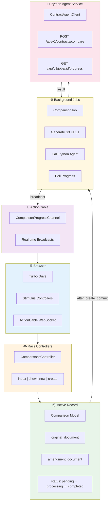
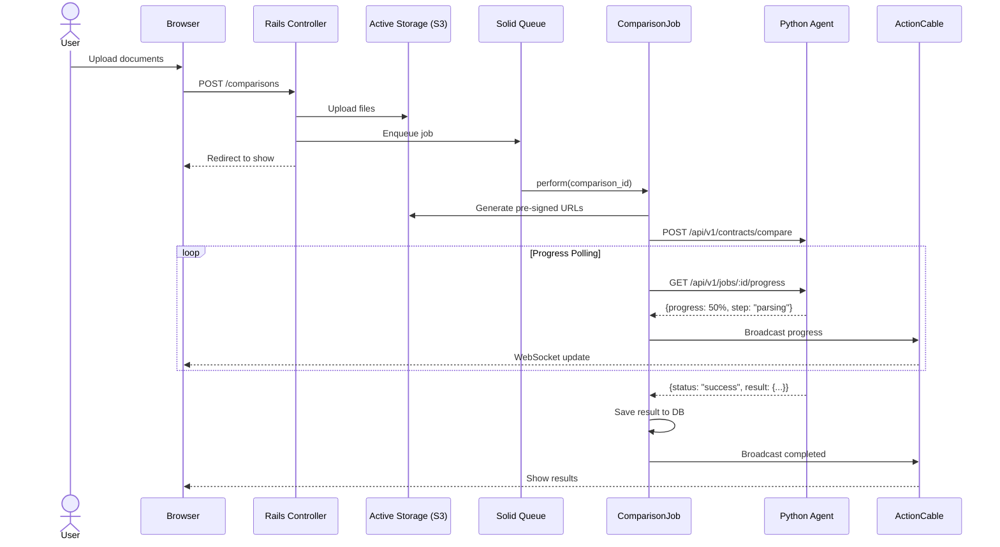
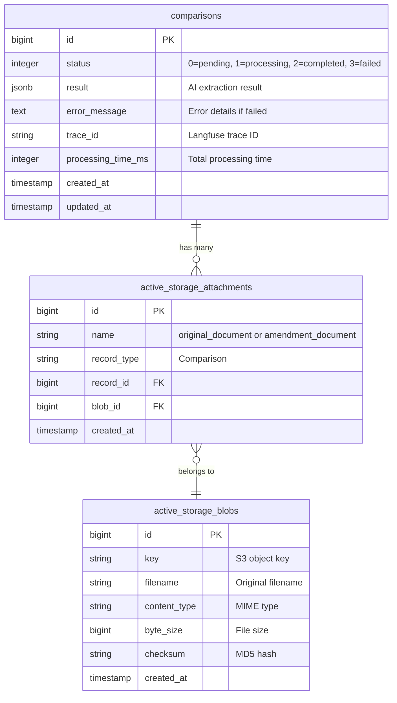

# Contract Comparison Platform - Ruby on Rails Frontend

<div align="center">


**Modern Web Interface for Contract Comparison**

</div>

---

## Overview

A Ruby on Rails 8 web application that provides a user-friendly interface for uploading and comparing contract documents. The application integrates with the Python AI backend to process contract comparisons and displays results with real-time progress updates via ActionCable.

### Key Features

- **Document Upload**: Drag-and-drop interface for uploading original contracts and amendments
- **Real-time Progress**: Live progress updates during AI processing via WebSockets
- **Result Visualization**: Clean display of changed sections, topics, and summaries
- **Async Processing**: Background jobs handle long-running AI comparisons
- **Cloud Storage**: AWS S3 integration for document storage via Active Storage

## Architecture



### Data Flow



## Prerequisites

- **Ruby** 3.2+
- **Rails** 8.0+
- **PostgreSQL** 15+
- **Node.js** 18+ (for asset compilation)
- **Redis** or **Solid Cable** (for ActionCable)
- **AWS S3** bucket (for document storage)

## Setup

### 1. Install Dependencies

```bash
cd ruby

# Install Ruby gems
bundle install

# Install JavaScript dependencies
bin/importmap pin
```

### 2. Configure Environment

```bash
cp .env.example .env
```

Edit `.env`:

```bash
# Database
DATABASE_URL=postgresql://localhost/contract_comparison_development

# Python Agent
PYTHON_AGENT_URL=http://localhost:8080

# AWS S3 (for Active Storage)
AWS_ACCESS_KEY_ID=your_key
AWS_SECRET_ACCESS_KEY=your_secret
AWS_REGION=us-east-1
AWS_BUCKET=your-bucket-name
```

### 3. Setup Database

```bash
bin/rails db:create
bin/rails db:migrate
```

### 4. Start Development Server

```bash
# Start all services (Rails + Solid Queue + Tailwind CSS)
bin/dev

# Or start individually
bin/rails server
bin/rails solid_queue:start
bin/rails tailwindcss:watch
```

The application will be available at `http://localhost:3000`

## Project Structure

```
ruby/
├── app/
│   ├── channels/
│   │   └── comparison_progress_channel.rb  # WebSocket channel
│   ├── controllers/
│   │   └── comparisons_controller.rb       # Main controller
│   ├── jobs/
│   │   └── comparison_job.rb               # Background processing
│   ├── models/
│   │   └── comparison.rb                   # Core model
│   ├── services/
│   │   └── contract_agent_client.rb        # Python agent HTTP client
│   └── views/
│       └── comparisons/
│           ├── index.html.erb              # List view
│           ├── show.html.erb               # Result view
│           └── new.html.erb                # Upload form
├── config/
│   ├── database.yml                        # PostgreSQL config
│   ├── cable.yml                           # ActionCable config
│   └── storage.yml                         # Active Storage (S3)
├── db/
│   └── migrate/                            # Database migrations
├── Gemfile                                 # Ruby dependencies
├── Procfile.dev                            # Development processes
└── Dockerfile                              # Container config
```

## Key Components

### Comparison Model

```ruby
class Comparison < ApplicationRecord
  has_one_attached :original_document
  has_one_attached :amendment_document
  
  enum :status, { pending: 0, processing: 1, completed: 2, failed: 3 }
  
  after_create_commit :enqueue_comparison_job
end
```

### ContractAgentClient

HTTP client for communicating with the Python AI backend:

```ruby
class ContractAgentClient
  include HTTParty
  base_uri ENV.fetch("PYTHON_AGENT_URL", "http://localhost:8080")
  
  def compare(original_url:, amendment_url:, contract_id:)
    # POST to Python agent with pre-signed S3 URLs
  end
  
  def get_progress(contract_id)
    # Poll for progress updates
  end
end
```

### ComparisonJob

Background job that orchestrates the comparison:

```ruby
class ComparisonJob < ApplicationJob
  queue_as :default
  retry_on StandardError, wait: 5.seconds, attempts: 3
  
  def perform(comparison_id)
    # 1. Update status to processing
    # 2. Generate pre-signed URLs
    # 3. Call Python agent
    # 4. Poll for progress (via thread)
    # 5. Broadcast updates via ActionCable
    # 6. Store result
  end
end
```

## Database Schema



## Running Tests

```bash
# Run all tests
bin/rails test

# Run system tests
bin/rails test:system

# Run with coverage
COVERAGE=true bin/rails test
```

## Deployment

### Docker

```bash
# Build image
docker build -t contract-comparison-rails .

# Run container
docker run -p 3000:3000 --env-file .env contract-comparison-rails
```

### Kamal (Production)

```bash
# Setup
kamal setup

# Deploy
kamal deploy
```

## Environment Variables

| Variable | Required | Description |
|----------|----------|-------------|
| `DATABASE_URL` | Yes | PostgreSQL connection string |
| `PYTHON_AGENT_URL` | Yes | Python backend URL |
| `AWS_ACCESS_KEY_ID` | Yes | AWS access key |
| `AWS_SECRET_ACCESS_KEY` | Yes | AWS secret key |
| `AWS_REGION` | Yes | AWS region |
| `AWS_BUCKET` | Yes | S3 bucket name |
| `RAILS_MASTER_KEY` | Prod | Rails credentials key |
| `SECRET_KEY_BASE` | Prod | Rails secret key |

## Technology Stack

| Component | Technology |
|-----------|------------|
| **Framework** | Ruby on Rails 8.0 |
| **Database** | PostgreSQL |
| **Job Queue** | Solid Queue |
| **WebSocket** | Solid Cable / ActionCable |
| **Cache** | Solid Cache |
| **CSS** | Tailwind CSS |
| **JS** | Hotwire (Turbo + Stimulus) |
| **File Storage** | Active Storage + S3 |
| **HTTP Client** | HTTParty |
| **Deployment** | Kamal / Docker |

## Contributing

1. Fork the repository
2. Create a feature branch (`git checkout -b feature/amazing-feature`)
3. Run tests (`bin/rails test`)
4. Commit changes (`git commit -m 'Add amazing feature'`)
5. Push to branch (`git push origin feature/amazing-feature`)
6. Open a Pull Request

## License

This project is part of the Contract Comparison Platform. See the root README for license information.
